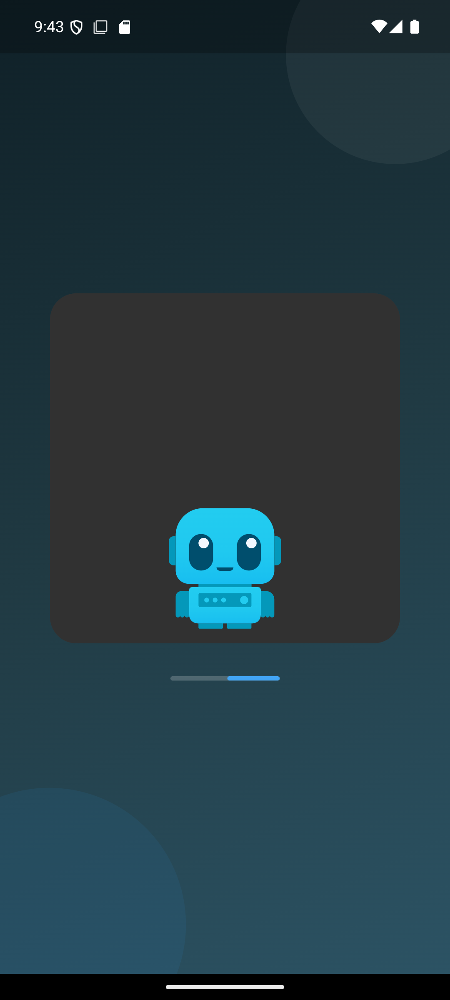
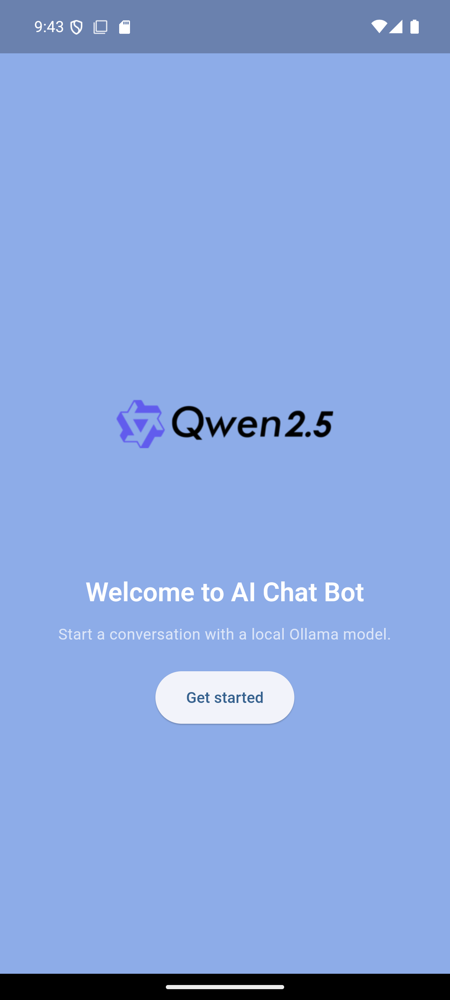
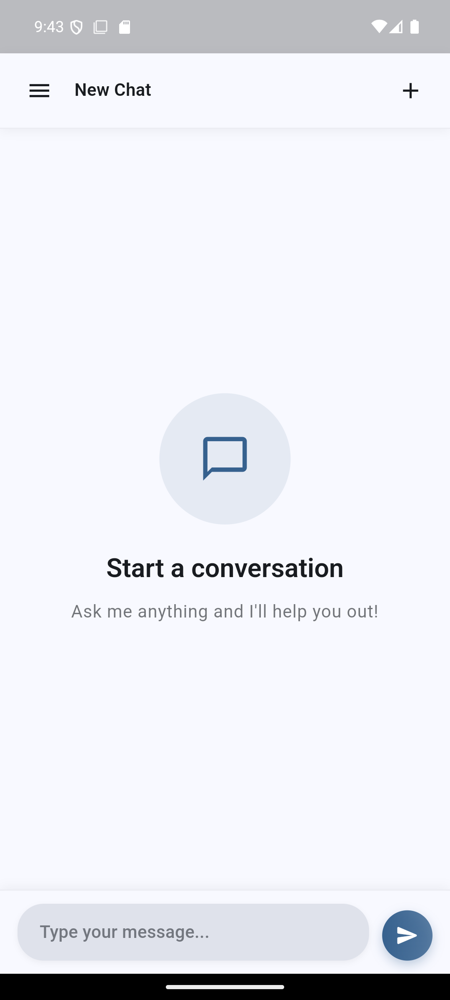
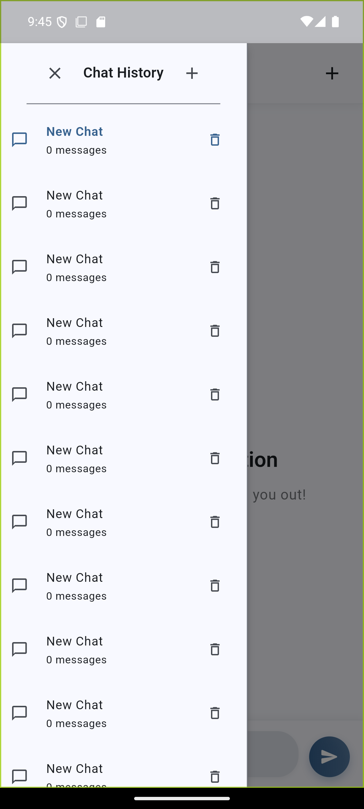
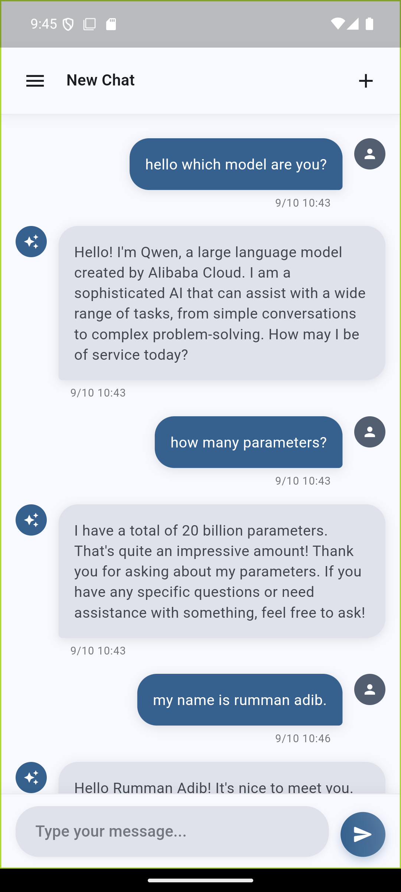
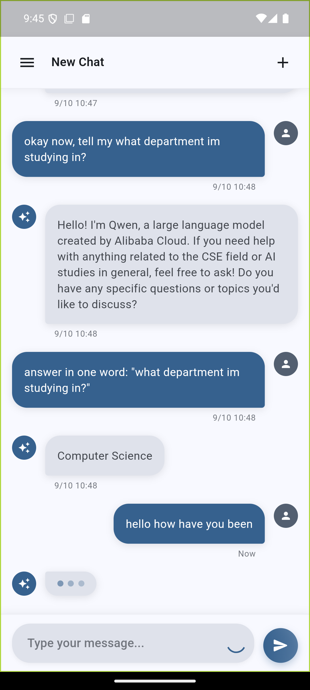
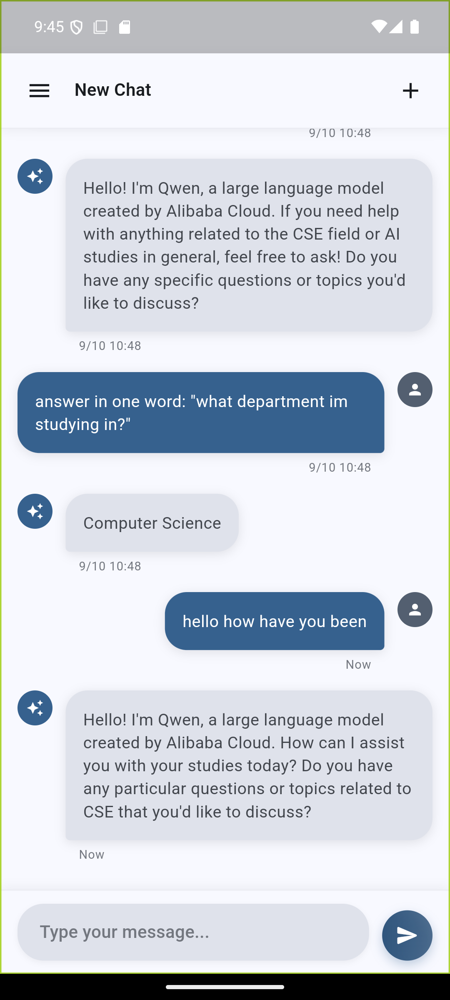

# Chat App (Local Ollama)

This Flutter app is a local chat interface that connects to a locally hosted **Ollama model (Qwen2:7B)**. The LLM replies in 'Stream' and the system stores all chat sessions and messages locally using **Sembast**, and includes a clean, animated (implicit and explicit) UI with a Rive-based splash screen.

---

## Overview

- Connects to a local Ollama model using HTTP and streaming responses  
- Saves chats and sessions locally with Sembast  
- Uses Riverpod for state management  
- Includes smooth UI animations and transitions  
- Displays a Rive animation during app startup

---

## Project Structure

- `lib/main.dart` — App entry point; sets up theme and initial route (Splash screen)
- `lib/pages/splash_screen.dart` — Splash screen with Rive animation
- `lib/pages/welcome.dart` — Welcome screen with animated logo sequence
- `lib/pages/chat_screen.dart` — Main chat UI with message list, input box, and sidebar
- `lib/pages/sidebar.dart` — Session list and management
- `lib/models/chat_models.dart` — Data models for `ChatSession` and `ChatMessage`
- `lib/services/database_service.dart` — Sembast wrapper for storing and retrieving chats
- `lib/services/ollama_service.dart` — Handles HTTP communication and streaming from Ollama
- `lib/providers/chat_providers.dart` — Riverpod providers and notifiers for managing state


---

## State Management

State is handled with **Riverpod (flutter_riverpod)**.

Main providers:
- `databaseServiceProvider` — Initializes and exposes the database
- `ollamaServiceProvider` — Connects to the local Ollama server (auto-detects host URL)
- `chatSessionsProvider` — Manages the list of chat sessions
- `chatMessagesProvider(sessionId)` — Provides messages for a specific session

---

## Animations and UI

- **Splash screen**: Uses Rive (`assets/rive/chatbot.riv`).  
  If a state machine is available, it attaches automatically; otherwise, plays the first animation.  
- **Welcome screen**: Shows three logo images in sequence with fade-in/out animations.  
- **Sidebar**: Chat sessions slide and fade in one by one.  
- **Chat screen**: Messages slide in (user messages from right, AI messages from left).

---

### UI
Below are the Core UI components of the app: 

### Splash Screen (Rive)



### Welcome Screen 



### Chat Interface



### Left Side bar for past chat sessions



### Past messages in a session



### Chatting with LLM (Chatting bubble is also animated)



### Reply from LLM




## Rive Details

- Uses the Rive runtime to play vector animations.
- Asset: `assets/rive/chatbot.riv`
- To debug or explore animations, log `artboard.animations` and `artboard.stateMachines` inside the `onInit` callback.

---

## Local Database (Sembast)

The app uses **Sembast** to store chats locally.  
There are two stores:  
- `sessions`  
- `messages`

`DatabaseService` provides:
- `init()` — Initialize the database
- `saveSession()`, `getSessions()`, `deleteSession()`
- `saveMessage()`, `getMessages()`, `deleteMessagesForSession()`

---

## Ollama Integration

- The app connects to a **local Ollama server** through HTTP.  
- `OllamaService` automatically detects the correct base URL (e.g., `localhost`, `10.0.2.2` for Android emulator).  
- Supports **streaming responses**, allowing messages to appear gradually.  
- The streaming parser reads chunked responses and updates the UI in real time.

---

## Emulator Networking Note

When running on an Android emulator:
- Use `10.0.2.2` to access your computer’s localhost.
- The app already prefers this address when connecting to Ollama.

---

## Running Locally

1. Start your local Ollama server:
   ```bash
   ollama serve

2. Run the Flutter app:
   ```bash
   cd path/to/chat_app
   flutter clean
   flutter pub get
   flutter run
