# Ecommerce App 

A simple demo of **Ecommerce mobile application** built with **Flutter**, and **Supabase**.  
This app demonstrates a complete shopping experience. Users can browse products, manage their cart and checkout reliably with the help of transactional handling in the backend.

---

## Overview

This project showcases:
- Product listing with categories and details  
- Shopping cart powered by Riverpod's state management 
- Checkout flow with validation and order confirmation  
- Stock validation and atomic order creation via Supabase/Postgres RPC  
- User authentication and profile management with Supabase Auth  

## UI
Below are the main UI components of the project
### Login

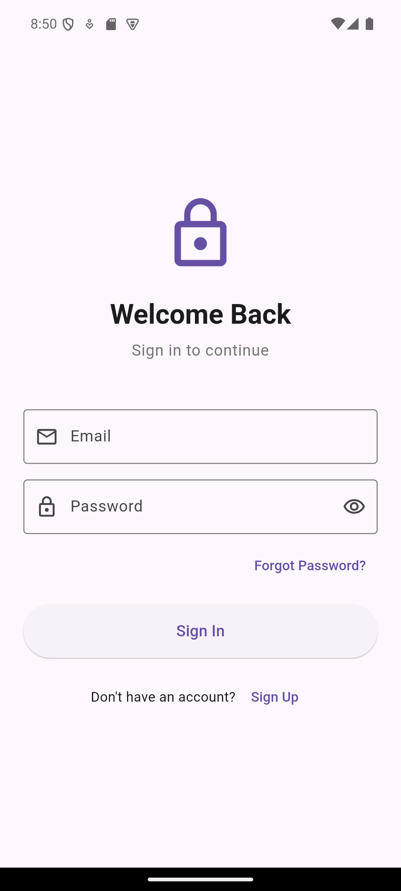

### Signup

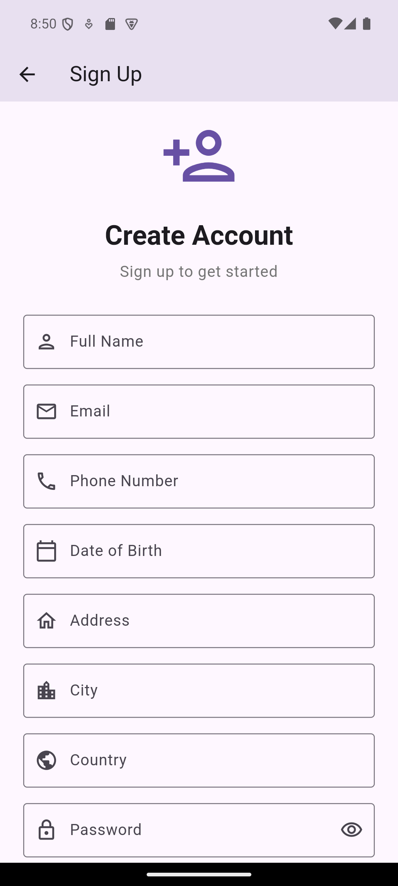

### Forgot Password 1

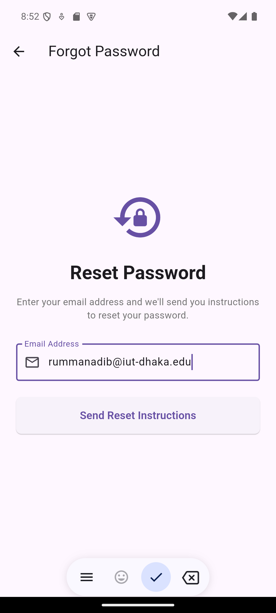

### Forgot Password 2

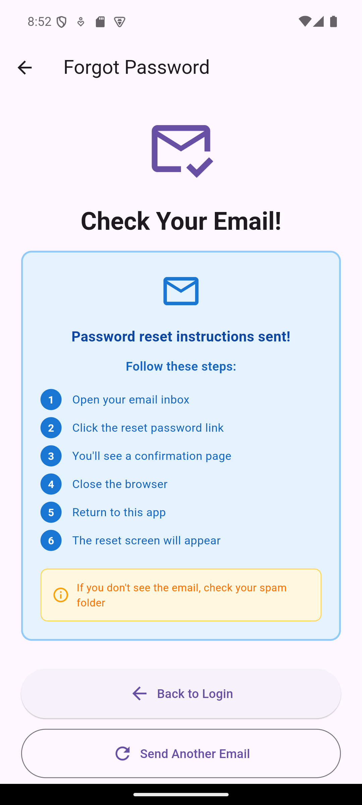

### Create New Password 1

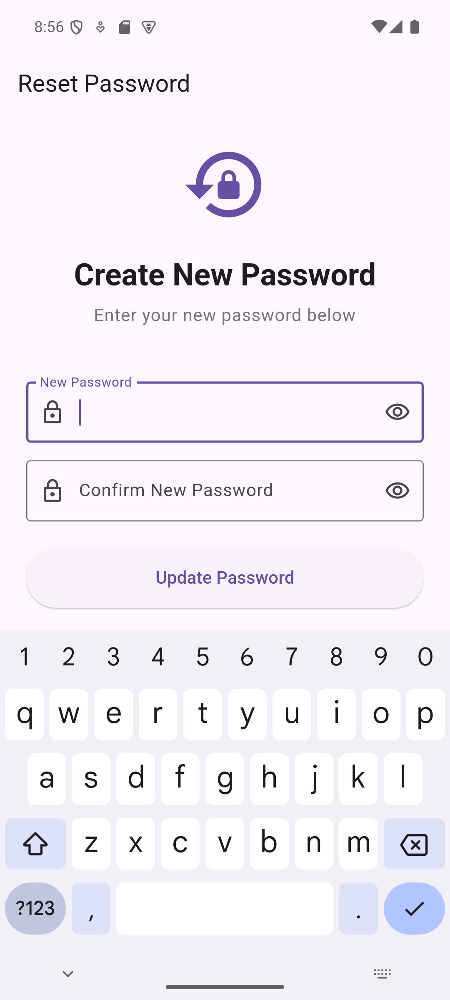

### Create New Password 2

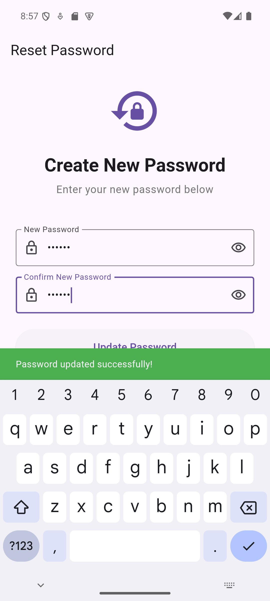

### User's Profile

### Upload/remove User's Profile Pic 

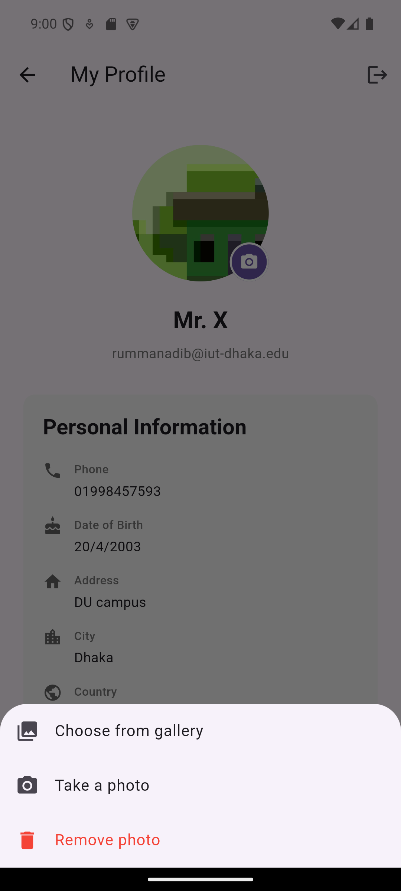

### General Dashboard (can show all products or products by category)

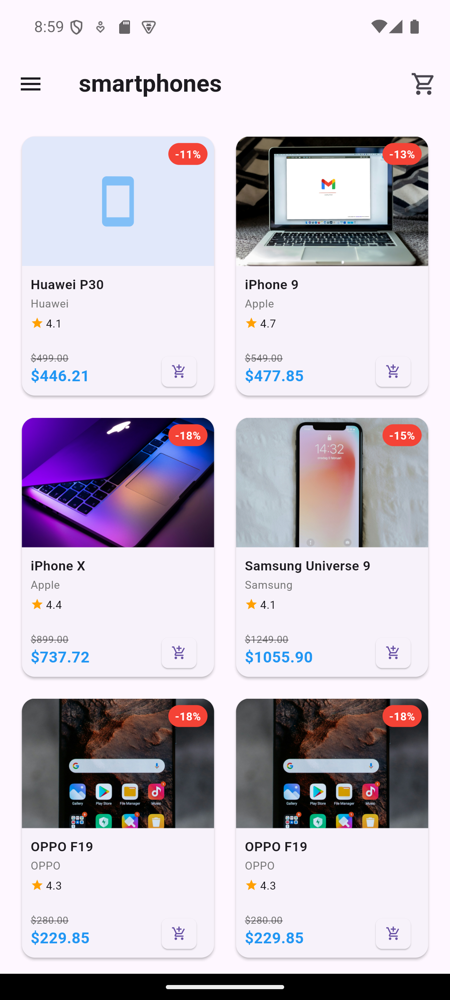

### Left Sidebar for existing categories

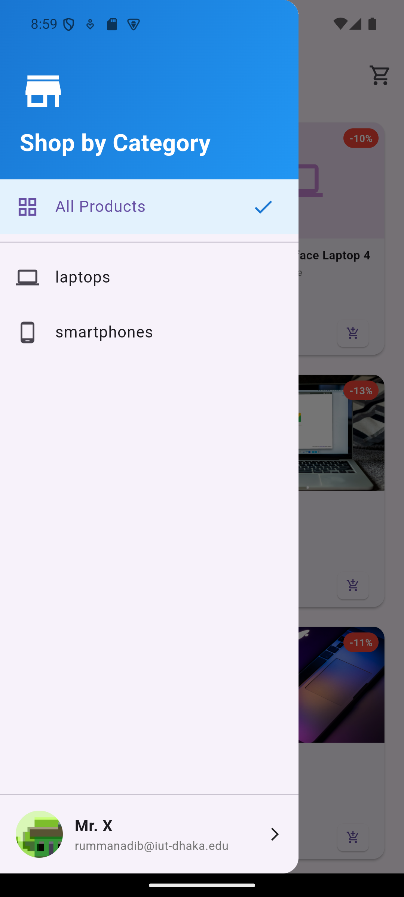

## Product details page 

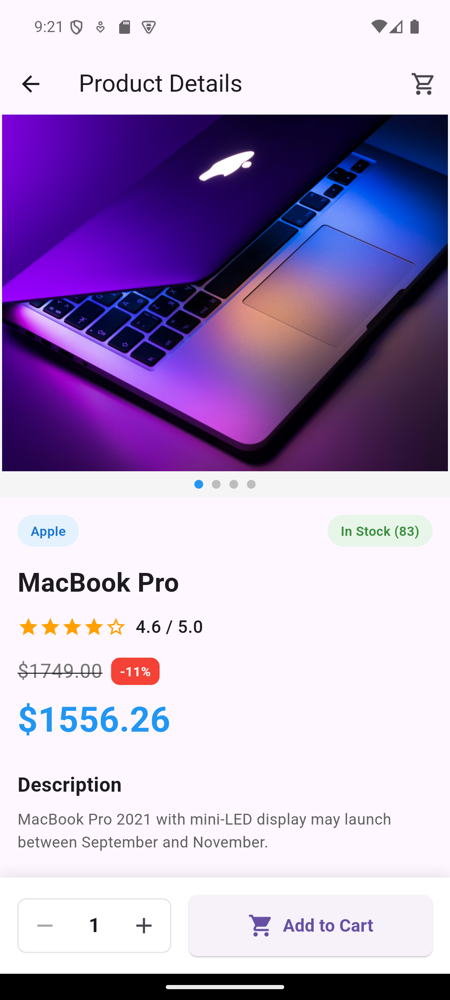

### Added 2 products in the cart (badge on the cart)

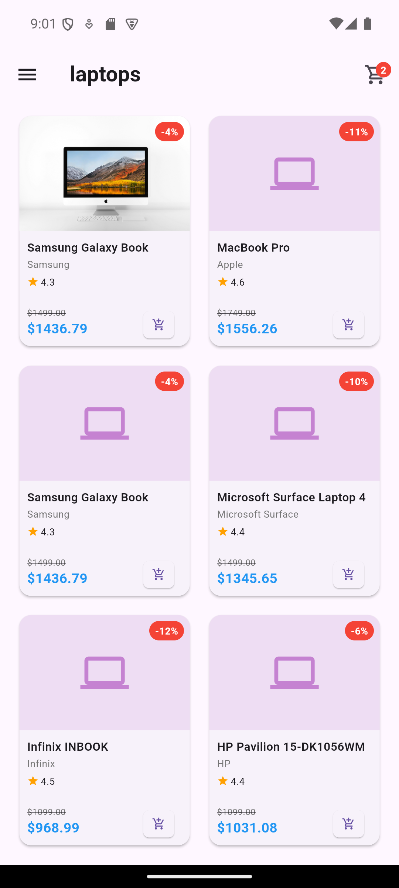

### Right sidebar for products in cart (can add/subtract, delete any quantity constrained to existing stock)

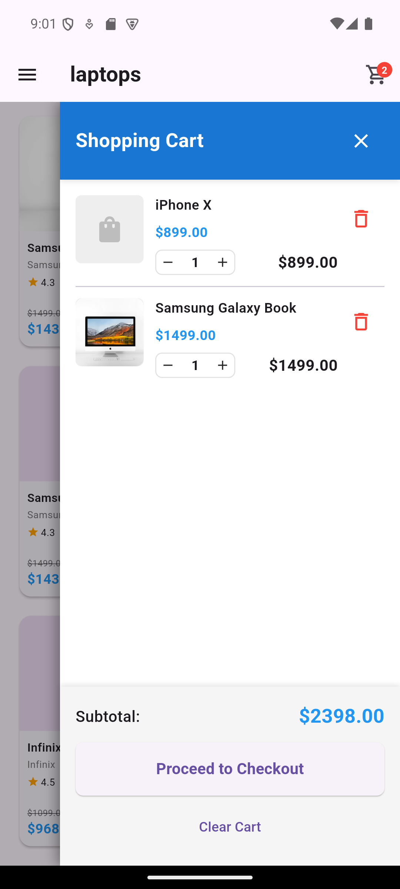

### Checkout Page

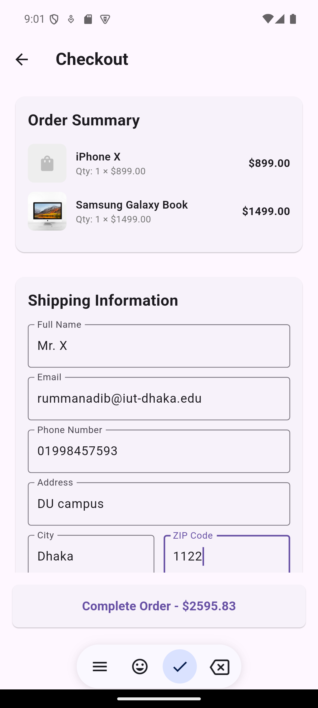

### Payment Processes (Dummy for now, can be extended to actual implementation)

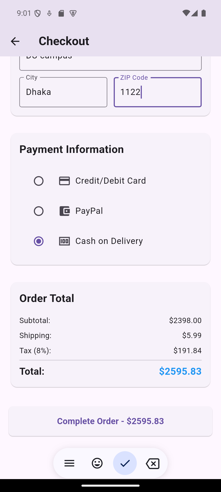

### Order confirmation

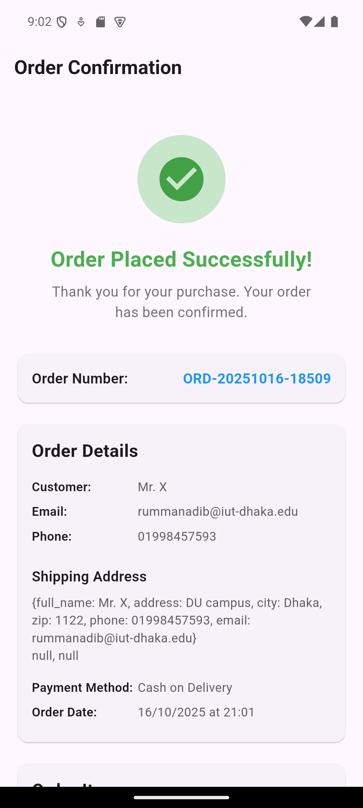

### Back to shopping!!

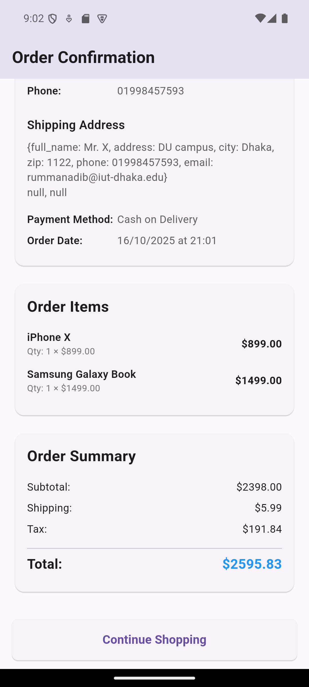

