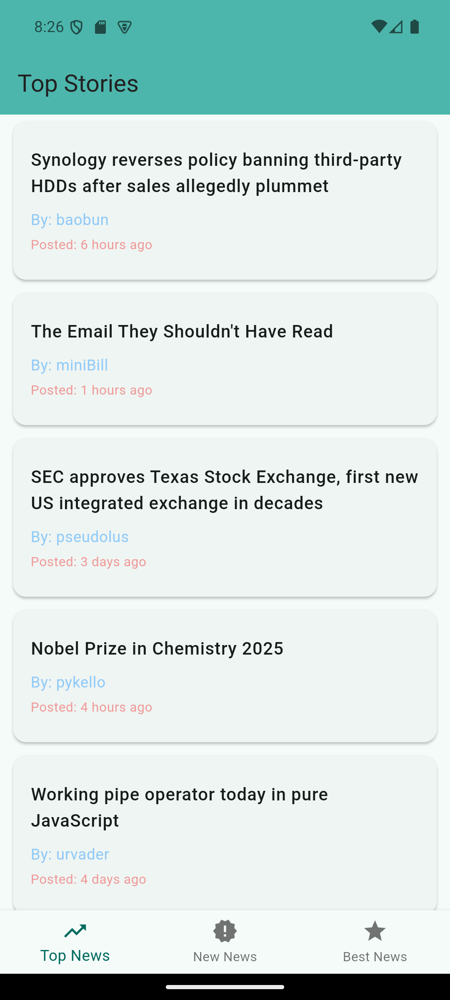
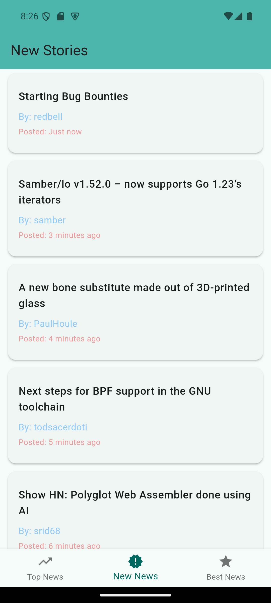
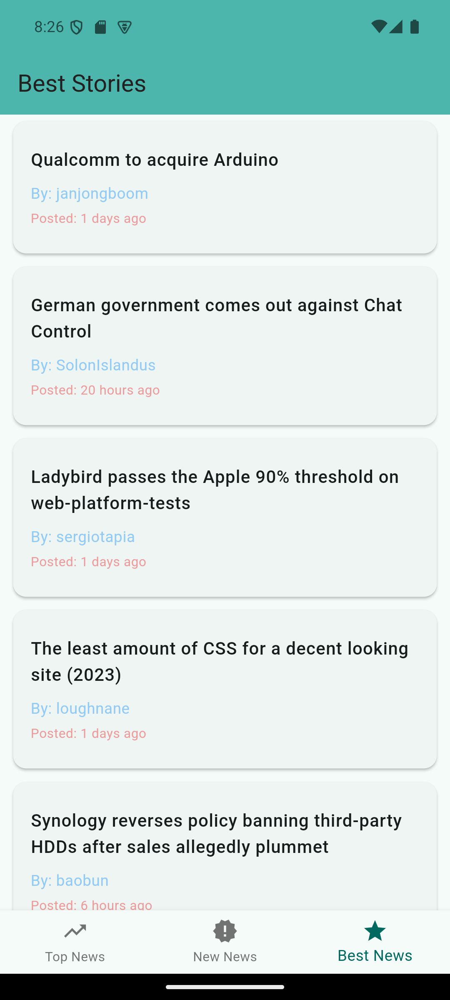
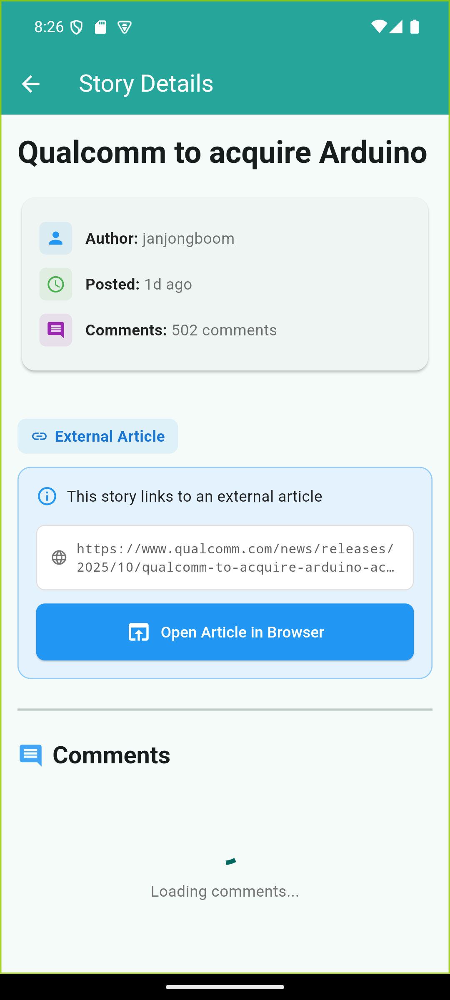
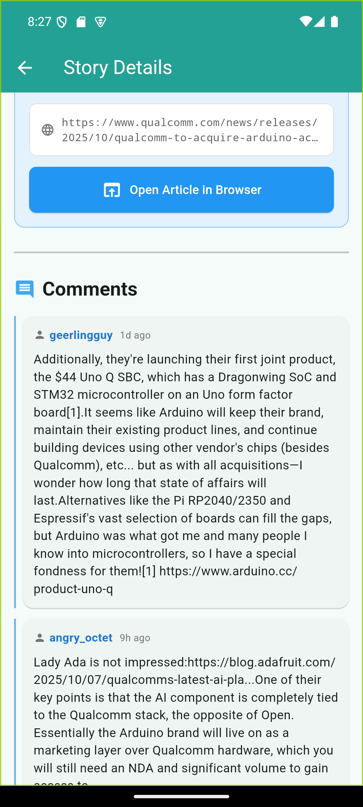

# News Reader App

Hacker News reader built with Flutter featuring a clean Material Design interface and robust state management.

## Tech Stack

- **Flutter** - UI Framework
- **Riverpod** - State Management  
- **Go Router** - Navigation & Routing
- **Sembast** - Local Database
- **Dio** - HTTP Client
- **Hacker News API** - Data Source

## Features in Detail

- **Smart Caching** Stories and comments are cached locally for 5 minutes

- **Error Handling** Graceful error states with retry functionality

- **Pull to Refresh** Refresh content with a simple pull gesture

## UI Screenshots

### Top Stories

### New Stories

### Best Stories

### News Details

### Comments

