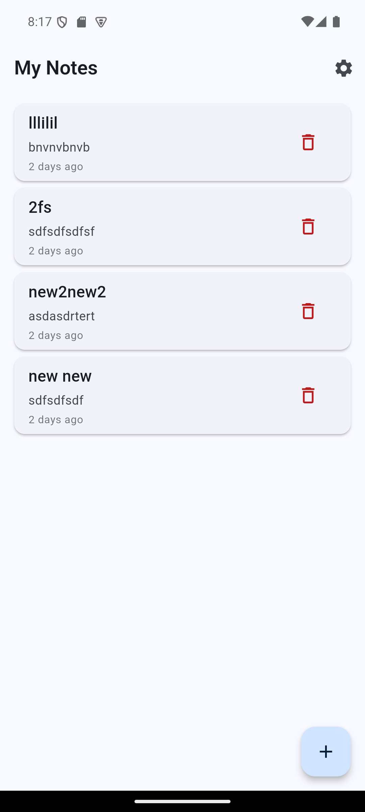
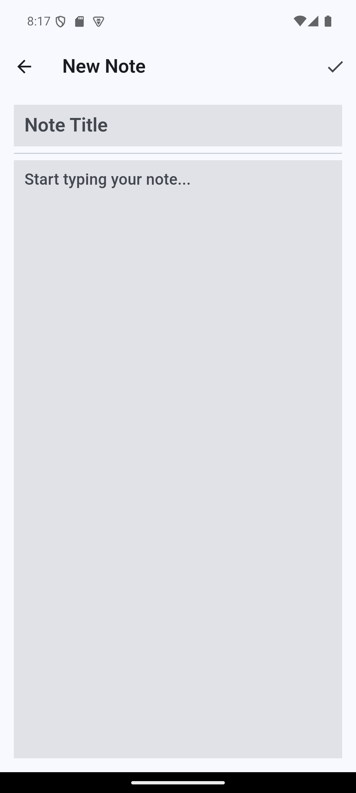
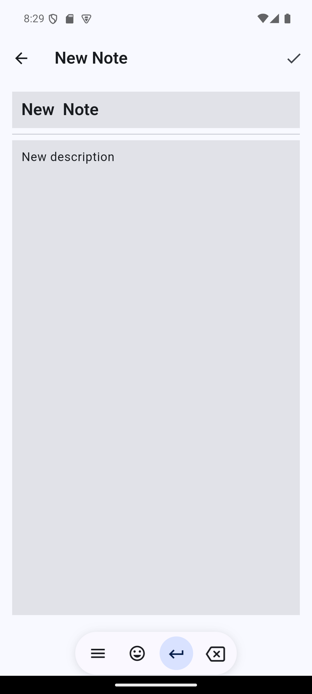
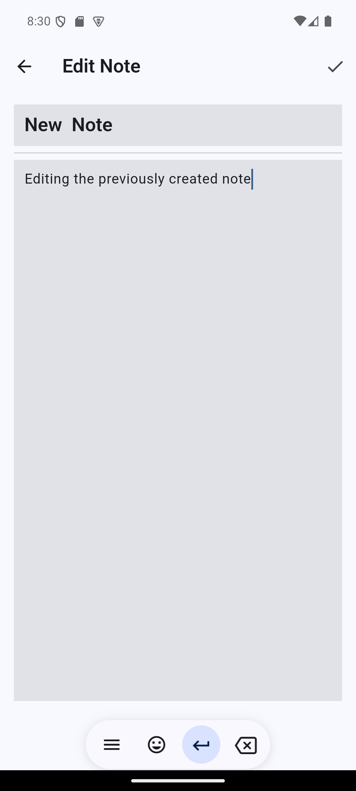
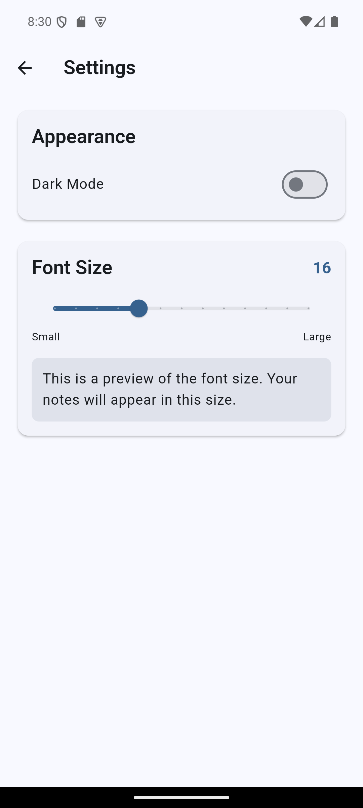
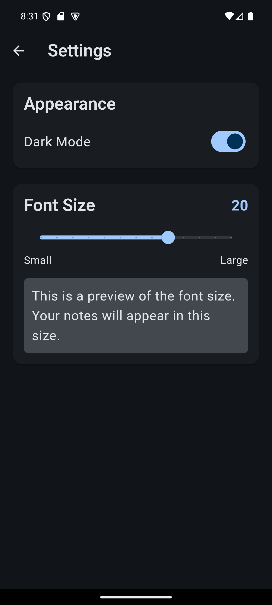

# notes_app
A simple note taking app with Sembast as a local database, and Riverpod for state management.

# Features
 - Add a note
 - Edit a note
 - Delete a note
 - Dark/Light mode
 - Font size selecting slider

# UI

## Main screen (Note list if there are saved notes, blank screen if no notes are save)

## Add a new note

## Edit a previously created note

## Setting page

